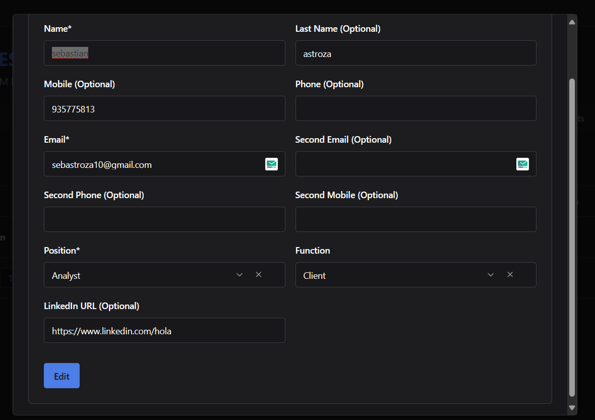

# ✏️ Editar Contacto

El CRM permite editar los contactos asociados a cada lead, facilitando la actualización de datos cuando sea necesario.

---

## 📋 Pasos para Editar un Contacto

### 1. Accede al Lead
- Ingresa al **CRM Dashboard**.
- Localiza el lead al que pertenece el contacto que deseas editar.
- Haz clic en el lead para abrir su vista de **detalle**.

---

### 2. Dirígete a la Pestaña "Contacts"
- Dentro del detalle del lead, selecciona la pestaña **Contacts**.
- Verás la lista de contactos asociados al lead.

---

### 3. Abre el Menú de Opciones del Contacto
- Ubica el contacto que deseas modificar.
- Haz clic en el ícono de tres puntos (`...`) en la columna **Action**.
- Selecciona la opción **"Edit"** del menú desplegable.

---

---

### 4. Modifica los Datos en el Formulario

El sistema mostrará el formulario de edición con los datos actuales del contacto. Los campos que puedes actualizar son:

| Campo                   | Descripción                                    | Obligatorio |
|-------------------------|------------------------------------------------|-------------|
| Name                    | Nombre del contacto.                           | ✅ Sí        |
| Last Name               | Apellido del contacto.                         | Opcional    |
| Mobile                  | Número móvil personal.                         | Opcional    |
| Phone                   | Teléfono fijo.                                 | Opcional    |
| Email                   | Correo electrónico principal.                  | ✅ Sí        |
| Second Email            | Correo electrónico alternativo.                | Opcional    |
| Second Phone            | Segundo teléfono fijo.                         | Opcional    |
| Second Mobile           | Segundo número móvil.                          | Opcional    |
| Position                | Cargo o puesto del contacto.                   | ✅ Sí        |
| Function                | Función o rol dentro de la empresa.            | Opcional    |
| LinkedIn URL            | Perfil de LinkedIn del contacto.               | Opcional    |

---

---

### 5. Guarda los Cambios
- Luego de actualizar los campos necesarios, haz clic en el botón **"Edit"** para guardar los cambios.
- El sistema actualizará la información del contacto en la lista de contactos del lead.

---

## ✅ Consideraciones Adicionales
- Solo usuarios con los permisos adecuados pueden editar contactos.
- Algunos campos pueden validarse automáticamente, como los correos electrónicos.
- Los cambios en los contactos no afectan los eventos registrados previamente, pero los nuevos eventos sí reflejarán la información actualizada.