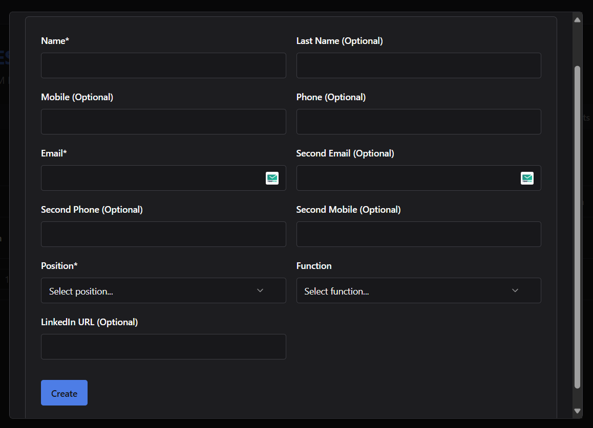
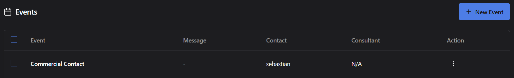

# ➕ Agregar Contacto

El módulo CRM permite asociar contactos específicos a cada lead mediante un formulario detallado, facilitando la gestión de relaciones clave.

---

## Pasos para Agregar un Contacto

### 1. Accede al Lead
- Ingresa al **CRM Dashboard**.
- Localiza el lead al cual deseas agregar un contacto.
- Haz clic en el lead para abrir su vista de **detalle**.

---

### 2. Abre la Pestaña "Contacts"
- Dentro del detalle del lead, selecciona la pestaña **Contacts**.
- Aquí podrás ver todos los contactos ya asociados (si existen).

---

### 3. Haz Clic en el Botón "New Contact"
- Haz clic en el botón **"New Contact"** para abrir el formulario de creación de contacto.

---

---

### 4. Completa el Formulario de Contacto

Este formulario incluye los siguientes campos:

| Campo                   | Descripción                                    | Obligatorio |
|-------------------------|------------------------------------------------|-------------|
| Name                    | Nombre del contacto.                           | ✅ Sí        |
| Last Name               | Apellido del contacto.                         | Opcional    |
| Mobile                  | Número móvil personal.                         | Opcional    |
| Phone                   | Teléfono fijo.                                 | Opcional    |
| Email                   | Correo electrónico principal.                  | ✅ Sí        |
| Second Email            | Correo electrónico alternativo.                | Opcional    |
| Second Phone            | Segundo teléfono fijo.                         | Opcional    |
| Second Mobile           | Segundo número móvil.                          | Opcional    |
| Position                | Cargo o puesto del contacto.                   | ✅ Sí        |
| Function                | Función o rol dentro de la empresa.            | Opcional    |
| LinkedIn URL            | Perfil de LinkedIn del contacto.               | Opcional    |

---

---

### 5. Guarda el Contacto
- Luego de completar los campos, haz clic en el botón **"Create"** para guardar el nuevo contacto.
- El sistema añadirá automáticamente el contacto a la lista del lead.

---

## Evento Automático Generado

> **Importante:**  
> Cada vez que registras un contacto nuevo, el sistema genera automáticamente un **evento** asociado al lead.

- Este evento se registra como **Commercial Contact** en la pestaña de **Events** del lead.
- También asocia el contacto creado como responsable del evento.
- Permite dejar un rastro automático de la creación del contacto para historial y trazabilidad.
---

---

## ✅ Consideraciones Adicionales
- Los campos **Name**, **Email** y **Position** son obligatorios para guardar el contacto.
- Los campos opcionales permiten registrar información adicional detallada.
- Puedes editar o eliminar contactos en cualquier momento desde la pestaña **Contacts**.

