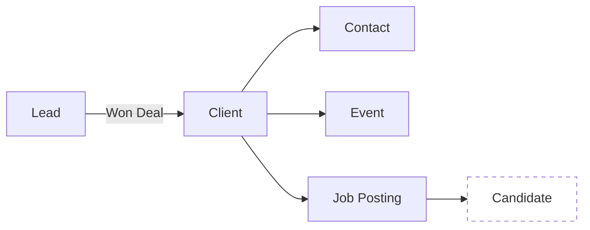

---

title: Estructura
description: Descripción detallada de los campos principales, subcolecciones y relaciones de datos en el módulo Clients.
sidebar_position: 5.1
----------------------

# 🏗️ Estructura del Módulo Clients

El módulo **Clients** está diseñado para almacenar toda la información relevante de los clientes ya convertidos, junto con sus contactos, eventos y ofertas de trabajo. A continuación se desglosa su **modelo de datos**, **subcolecciones internas** y las **relaciones** con otros módulos.

---

## 1. Campos Principales del Recurso **Client**

| Campo          | Tipo     | Obligatorio | Descripción                                             |
| -------------- | -------- | :---------: | ------------------------------------------------------- |
| `id`           | String   |     ✅ Sí    | Identificador único autogenerado (ej: `CL-0000000079`). |
| `companyName`  | String   |     ✅ Sí    | Nombre oficial de la empresa/cliente.                   |
| `companyEmail` | Email    |     ✅ Sí    | Correo principal de contacto.                           |
| `companyPhone` | String   |     ❌ No    | Teléfono de contacto.                                   |
| `website`      | URL      |     ❌ No    | URL del sitio web de la empresa.                        |
| `linkedinUrl`  | URL      |     ❌ No    | Perfil de LinkedIn corporativo.                         |
| `address`      | String   |     ❌ No    | Dirección física (calle, ciudad, país).                 |
| `country`      | String   |     ✅ Sí    | País del cliente (código ISO o nombre completo).        |
| `area`         | String   |     ❌ No    | Área de negocio (ej: Technology, Mining, Retail).       |
| `companyType`  | String   |     ✅ Sí    | Tipo de empresa (ej: Holding, Subsidiary, Partner).     |
| `status`       | Enum     |     ✅ Sí    | Estado del cliente (`ACTIVE`, `INACTIVE`, `PROSPECT`).  |
| `createdAt`    | DateTime |     ✅ Sí    | Fecha de creación del registro.                         |
| `updatedAt`    | DateTime |     ✅ Sí    | Fecha de la última modificación.                        |

---

## 2. Subcolecciones Internas

Cada **Client** tiene tres subcolecciones clave que permiten un seguimiento granular:

### 2.1 Contacts

* **Estructura de un Contacto:**

  | Campo          | Tipo   | Obligatorio | Descripción                       |
  | -------------- | ------ | :---------: | --------------------------------- |
  | `id`           | String |     ✅ Sí    | Identificador único del contacto. |
  | `name`         | String |     ✅ Sí    | Nombre del contacto.              |
  | `lastName`     | String |     ❌ No    | Apellido (opcional).              |
  | `email`        | Email  |     ✅ Sí    | Correo principal.                 |
  | `secondEmail`  | Email  |     ❌ No    | Correo alternativo.               |
  | `phone`        | String |     ❌ No    | Teléfono fijo o extensión.        |
  | `mobile`       | String |     ❌ No    | Teléfono móvil.                   |
  | `secondPhone`  | String |     ❌ No    | Segundo teléfono (opcional).      |
  | `secondMobile` | String |     ❌ No    | Segundo móvil (opcional).         |
  | `position`     | String |     ✅ Sí    | Cargo o título (ej: Manager).     |
  | `function`     | String |     ❌ No    | Rol o departamento.               |
  | `linkedinUrl`  | URL    |     ❌ No    | Perfil LinkedIn personal.         |
  | `comments`     | Text   |     ❌ No    | Notas internas sobre el contacto. |

### 2.2 Events

* **Estructura de un Evento:**

  | Campo         | Tipo        | Obligatorio | Descripción                                           |
  | ------------- | ----------- | :---------: | ----------------------------------------------------- |
  | `id`          | String      |     ✅ Sí    | Identificador único del evento.                       |
  | `eventType`   | Enum        |     ✅ Sí    | Tipo de evento (Meeting, Client Won, Proposal Sent…). |
  | `contactId`   | String      |     ✅ Sí    | ID del contacto asociado (o `null` si no aplica).     |
  | `description` | Text        |     ❌ No    | Comentarios o detalles adicionales.                   |
  | `documents`   | Array|     ❌ No    | Archivos adjuntos (PDF, imágenes, etc.).              |
  | `createdAt`   | DateTime    |     ✅ Sí    | Fecha y hora de registro del evento.                  |

### 2.3 Jobs

* **Estructura de una Oferta (`Job Posting`):**

  | Campo              | Tipo     | Obligatorio | Descripción                                                    |
  | ------------------ | -------- | :---------: | -------------------------------------------------------------- |
  | `id`               | String   |     ✅ Sí    | Identificador único de la oferta.                              |
  | `jobTitle`         | String   |     ✅ Sí    | Título de la posición.                                         |
  | `positionType`     | String   |     ✅ Sí    | Categoría de la posición (IT & Digital, Sales…).               |
  | `salaryRange`      | Object   |     ✅ Sí    | `{ min: Number, max: Number }`                                 |
  | `feePercentage`    | Number   |     ✅ Sí    | Porcentaje de comisión (0–100%).                               |
  | `commercialScheme` | String   |     ✅ Sí    | Esquema comercial (Success Fee, Retainer…).                    |
  | `guaranteeMonths`  | Number   |     ✅ Sí    | Garantía en meses (p.ej. 1, 3).                                |
  | `hasCancellation`  | Boolean  |     ✅ Sí    | Indica si aplica cláusula de cancelación.                      |
  | `cancellationRate` | Number   |   ❌ Cond.   | Porcentaje de cancelación (0–100%), solo si `hasCancellation`. |
  | `notes`            | Text     |     ❌ No    | Notas adicionales o condiciones especiales.                    |
  | `forecastRevenue`  | Currency |     ✅ Sí    | Cálculo de ingresos estimados (salario \* feePercentage).      |
  | `createdAt`        | DateTime |     ✅ Sí    | Fecha de publicación de la oferta.                             |

---

## 3. Relaciones con Otros Modelos

