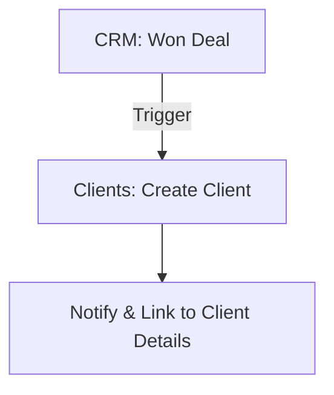
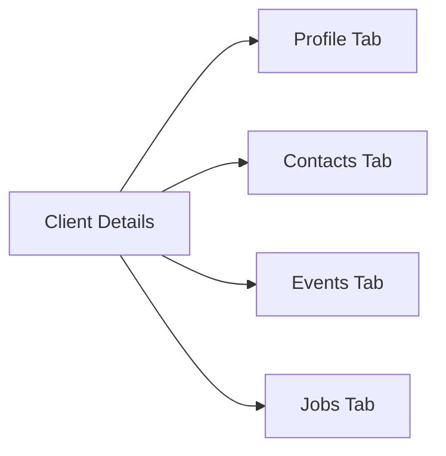
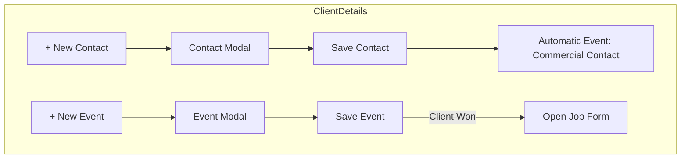
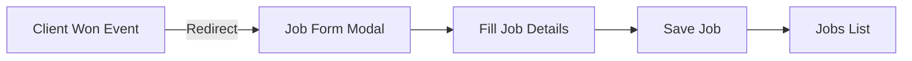

# 🔄 Flujos del Módulo Clients

Este documento describe **todos** los flujos de trabajo dentro del módulo **Clients**, desde la creación automática tras un Lead "Won" en CRM hasta la gestión de contactos, eventos y ofertas de trabajo. Los diagramas y pasos a continuación ayudan a entender cada etapa y los procesos automáticos asociados.

---

## 1. Conversión Automática desde CRM

1. **Evento “Won Deal” en CRM**

   - El usuario registra en **CRM → Leads** un evento de tipo **Won Deal**.
   - **Trigger automático:** se crea un **Client** en este módulo con todos los datos del Lead.

2. **Notificación y Redirección**

   - Tras crearse el Cliente, se muestra una notificación de éxito.
   - El usuario puede hacer clic en **View Client** para ir a **Clients → Client Details**.

---

## 2. Dashboard Principal de Clients

En **Clients → Dashboard** el usuario dispone de:

- 🔍 **Búsqueda** por nombre, correo o código de cliente.
- 🎛️ **Filtros:**
  - Rango de fechas de creación.
  - Estado (**ACTIVE** / **INACTIVE**).
  - Área de negocio (Technology, Retail, etc.).
- 📊 **Paginación y contador** de total de clientes.

Los filtros pueden combinarse para segmentar la lista de forma precisa y en tiempo real.

---

## 3. Vista Detalle de Cliente

Al hacer **View** sobre un cliente en la tabla:

### 🔹 **Profile**

- Muestra los datos maestros:\
  `companyName`, `companyEmail`, `companyPhone`, `website`, `linkedinUrl`, `address`, `country`, `area`, `companyType`, `status`.
- Botones **Edit Client** y **Cancel**.

### 🔹 **Contacts**

- Listado de contactos asociados.
- Botón **➕ + New Contact** abre el modal de creación.
- Al guardar, se añade un evento **“Commercial Contact”** en la pestaña **Events**.

### 🔹 **Events**

- Historial cronológico de interacciones: reuniones, propuestas, encuestas, cierres.
- Botón **➕ + New Event** abre el modal de registro.
- Si se selecciona **Client Won**, al guardar se abre automáticamente el formulario **Create Job**.

### 🔹 **Jobs**

- Lista de ofertas de trabajo asociadas al cliente.
- Filtros: `Position Type`, `Salary Range`, `Created Date`.
- Acciones por oferta: 🔍 **View**, ✏️ **Edit**, 🗑️ **Delete**.

---

## 4. Flujo de Creación de Contactos y Eventos

- **Crear Contacto**:

  - El usuario pulsa **+ New Contact** y completa el formulario.
  - Al guardar, el contacto aparece en la lista y se registra un evento **“Commercial Contact”**.

- **Registrar Evento**:

  - El usuario pulsa **+ New Event** y selecciona tipo de evento (**Meeting**, **Proposal Sent**, etc.).
  - Al guardar:
    - **Client Won** → abre automáticamente el **Create Job Form**.
    - Otros tipos → solo registra el evento en **Events**.

---

## 5. Flujo de Publicación de Ofertas (Jobs)

- **Open Job Form**: El modal se abre con valores preconfigurados (título, esquema comercial).

- **Complete Job Modal**:

  - **Basic Information**: `Job Title`, `Position Type`.
  - **Compensation & Terms**: `Minimum/Maximum Salary`, `Fee %`, `Guarantee Months`.
  - **Additional Terms**: marcar **Has Cancellation** para mostrar `Cancellation Rate`.
  - **Notes**: comentarios adicionales.

- **Guardar Oferta**:

  - La nueva oferta se añade a la pestaña **Jobs**, lista para filtrar, editar o eliminar.
  - Mientras el **Job** no se guarde, el cliente permanece en estado **“won”** sin oferta asociada.

---

## 6. Validaciones y Restricciones

### 🔸 **Campos obligatorios**:

- **Client**: `companyName`, `companyEmail`, `country`, `companyType`.
- **Contact**: `name`, `email`, `position`.
- **Event**: `eventType`, `contactId`.
- **Job**: `jobTitle`, `positionType`, `salaryRange`, `feePercentage`, `commercialScheme`, `guaranteeMonths`.

### 🔸 **Control de duplicados**:

- `companyEmail` y correos de **Contacts** deben ser únicos.
- ID/Código autogenerados (`CL-…`, `JO-…`) no son editables.

### 🔸 **Eliminaciones condicionadas**:

- Un **Client** con ofertas **Jobs** activas no puede eliminarse.
- Un **Contact** o **Event** vinculado a flujos críticos (**Client Won → Job**) no es borrable.
- Los formularios bloquean el botón **Save** hasta que todos los campos obligatorios sean válidos.

---

## 7. Resumen de Flujos

| Flujo                | Disparador          | Resultado / Trigger Automático     |
| -------------------- | ------------------- | ---------------------------------- |
| Lead → Client        | Won Deal (CRM)      | Creación de Client                 |
| Client → New Contact | Click + New Contact | Evento “Commercial Contact”        |
| Client → New Event   | Click + New Event   | Si “Client Won” → abre Job Form    |
| Job Creation         | Save Job            | Job Posting en la pestaña Jobs     |
| Delete Restrictions  | Intento de borrado  | Bloqueo si hay registros asociados |

Con estos diagramas, pasos y restricciones tendrás una visión completa de cómo fluye la gestión de clientes en el módulo **Clients**, garantizando transparencia y consistencia en todo el ciclo de vida.

