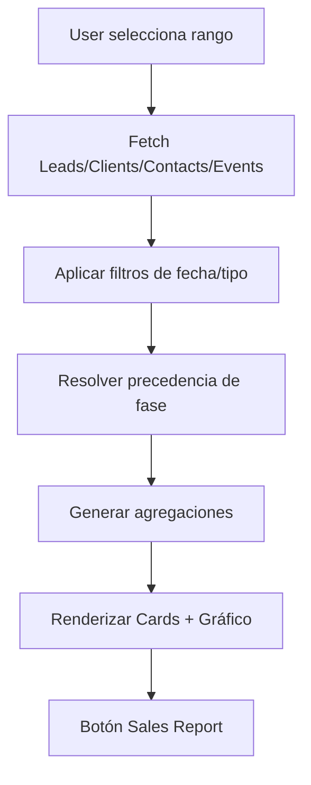

# 🔄 Flujos del Módulo Dashboard

Este documento describe los **flujos de información** y los procesos automáticos que intervienen en el **Dashboard**.  
Desde la selección de fechas hasta el renderizado de métricas y gráficos.

---

## 1. Selección de rango de fechas

1. El usuario define un rango (**inicio / fin**).  
2. El sistema consulta todos los **Leads**, **Clients**, **Contacts** y **Events** creados en ese periodo.  
3. Se refrescan los contadores y gráficos de forma automática.

---

## 2. Resolución de fase por Lead/Client

Para cada Lead/Client encontrado en el rango:

1. Se buscan todos los **eventos** asociados.  
2. Se ordenan por **precedencia**:
   - `COMMERCIAL CONTACT`  
   - `MEETING`  
   - `PROPOSALS`  
   - `LEAD WON`  
   - `LOST DEAL`  
3. Solo se contabiliza la **fase más avanzada**.

> Ejemplo: un Lead con `COMMERCIAL CONTACT` y `MEETING` se cuenta únicamente en **MEETING**.

---

## 3. Agregaciones

- **Header (cards):** totales de `Clients`, `Leads`, `Contacts`, `Meetings`, `Proposals`.  
- **Funnel por fase:** métricas por cada fase (con precedencia aplicada).  
- **Company Type:** totales de `Subsidiary`, `Holding`, `Single Entity`.  
- **Gráfico de barras:** evolución temporal (día/semana/mes) de los valores calculados.

---

## 4. Visualización

---

## 5. Sales Report

- El botón **Sales Report** abre un reporte detallado con los mismos filtros y periodo activo.  
- Permite **exportar** o **imprimir** la información mostrada en el Dashboard.