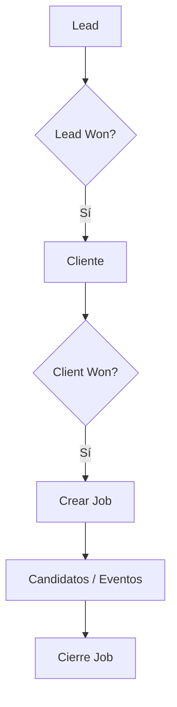

# 🔄 Flujos del Módulo Jobs

El módulo **Jobs** forma parte del flujo natural de conversión de un *Lead* hasta la gestión de posiciones laborales activas. Este módulo **no puede utilizarse de forma aislada**, sino que depende de eventos y relaciones anteriores en el sistema ATS.

---

## 🚀 Flujo típico de uso

A continuación, se describe el flujo completo para la creación y gestión de un Job:

1.  **Lead creado**: Un posible cliente ingresa al sistema.
2.  Se generan **contactos** y **eventos** en el Lead.
3.  Cuando el evento clave `Lead Won` es registrado, el Lead se convierte en un **Cliente**.
4.  Una vez en estado de Cliente, se registra el evento `Client Won`, lo cual **habilita la creación de Jobs** para ese cliente.
5.  El usuario puede **crear uno o más Jobs** asociados a ese cliente.
6.  Desde el módulo Job, se pueden:
    * Cargar candidatos.
    * Registrar eventos del proceso de selección.
    * Descargar documentos asociados.
    * Modificar estado o detalles del Job.
7.  Finalmente, el Job puede cambiar de estado (`Closed`, `Paused`, etc.), lo que marca el cierre o pausa del proceso de selección.

### 📊 Diagrama de flujo

---

## ⚙️ Acciones que disparan procesos automáticos

* **Evento Client Won**: Este evento es obligatorio para habilitar la pestaña y funcionalidad de **Jobs** en el cliente.
* **Creación de un Job**: Habilita la posibilidad de cargar candidatos, iniciar procesos de selección y registrar eventos relacionados.
* **Cambio de estado del Job a Closed**: Actúa como cierre operativo, inhabilitando nuevas acciones relacionadas a ese **Job**.

---

## ✅ Validaciones y restricciones

El sistema contiene varias validaciones que aseguran la coherencia e integridad del flujo:

### 📍 Validaciones previas

* No se pueden crear **Jobs** si el cliente **no tiene el evento Client Won**.
* Cada **Job** debe estar **asociado a un cliente específico** (obligatorio).

### 🚩 Validaciones de campos

Campos obligatorios en la creación de un **Job**:

* Título (`Job Title`)
* Estado (`Status`)
* Seniority
* Tipo de trabajo (`Job Type`)
* Fecha de inicio (`Start Date`)

Validaciones de formato:

* Rango salarial debe tener valores numéricos válidos.
* La fecha de fin (`End Date`) no puede ser anterior a la de inicio.

### 🔐 Restricciones lógicas

* Un **Job** no puede existir sin cliente asignado.
* Un **Job** no puede estar en estado `Open` si no tiene título o detalles básicos cargados.
* La creación de candidatos solo es posible si el **Job** está en estado `Open` o `In Progress`.

---

## 💡 Consideraciones adicionales

* Los **Jobs** son independientes entre sí, pero comparten estructura de gestión.
* Cada **Job** puede ser editado, duplicado o eliminado desde el listado general.
* Los eventos registrados en el contexto del **Job** no afectan a eventos del cliente.